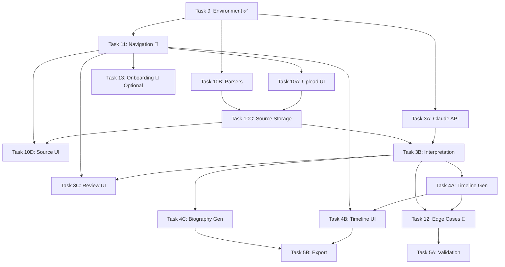

# Task 0: Pre-Implementation Review Results

**Date:** 2025-10-30
**Status:** ✅ Complete
**Recommendation:** 🟡 CONDITIONAL GO (with critical questions answered first)

---

## Executive Summary

The task breakdown is **well-structured and comprehensive**, with excellent alignment to the three-layer architecture. The TypeScript types are already defined, data directories are in place, and Task 9 is complete. However, there are **critical decisions and edge cases** that need clarification before implementation begins.

### Key Findings:
- ✅ Task breakdown covers all major features from CLAUDE.md
- ✅ Three-layer architecture (Source/Interpretation/Synthesis) fully represented
- ✅ Dependencies are logical and mostly correct
- ⚠️ Missing critical edge case handling tasks
- ⚠️ Some technical decisions need clarification
- ⚠️ Security and file validation needs strengthening
- 🔴 Missing API integration (Anthropic SDK not installed)
- 🔴 Missing navigation/routing structure

---

## 1. Task Completeness Analysis

### ✅ Approved Coverage

| Area | Tasks | Status |
|------|-------|--------|
| Source Layer (Upload/Parse/Store) | 10A-10D | ✅ Complete |
| Interpretation Layer (Claude API) | 3A-3C | ✅ Complete |
| Synthesis Layer (Timeline/Biography) | 4A-4C | ✅ Complete |
| Quality & Export | 5A-5B | ✅ Complete |

### 🚫 Missing Tasks

#### **CRITICAL: Task 11 - Navigation & Layout** (REQUIRED BEFORE 10A)
**Why it's critical:** Users won't be able to navigate between pages without a navigation structure.

**Proposed Task 11:**
```markdown
### Task 11: Navigation & Layout Infrastructure
**Dependencies:** Task 9 ✅
**Blocks:** Task 10A (upload page needs nav)
**Estimated time:** 1 hour

- [ ] Update root layout (`app/layout.tsx`) with navigation component
- [ ] Create NavBar component with links to Upload/Sources/Review/Timeline/Biography/Export
- [ ] Add active page highlighting
- [ ] Style with Tailwind CSS (teal theme, stick figure logo)
- [ ] Test navigation flow across all pages
- Location: `app/layout.tsx`, `app/components/NavBar.tsx`
```

**Required Dependency Updates:**
- Task 10A now depends on Task 11
- Task 10D now depends on Task 11

#### **CRITICAL: Task 12 - Error Handling & Edge Cases** (REQUIRED BEFORE 5A)
**Why it's critical:** Current tasks don't systematically handle data integrity violations.

**Proposed Task 12:**
```markdown
### Task 12: Data Integrity & Edge Case Handling
**Dependencies:** Task 3B, Task 4A
**Blocks:** Task 5A
**Estimated time:** 2-3 hours

- [ ] Implement orphaned interpretation handler (when source is deleted)
- [ ] Add conflict detection for contradictory data across sources
- [ ] Create UI for resolving conflicts (side-by-side comparison)
- [ ] Add cascade delete confirmation (e.g., "Deleting source will affect 5 interpretations")
- [ ] Implement soft delete for sources (mark as deleted but preserve data)
- [ ] Add data recovery UI for soft-deleted sources
- [ ] Test cascade scenarios (delete source → update interpretations → update synthesis)
- Location: `lib/validators/integrity.ts`, `app/components/ConflictResolver.tsx`
```

#### **RECOMMENDED: Task 13 - Onboarding & Help**
**Why it's recommended:** First-time users won't understand the three-layer architecture without guidance.

**Proposed Task 13:**
```markdown
### Task 13: Onboarding & Help System
**Dependencies:** Task 11
**Blocks:** None (can be done in parallel with other tasks)
**Estimated time:** 1-2 hours

- [ ] Create onboarding modal explaining three-layer architecture
- [ ] Add tooltip system for confidence scores (emerald = high, amber = medium, red = low)
- [ ] Create help page with FAQs and workflow diagram
- [ ] Add empty states with stick figure illustrations and clear CTAs
- [ ] Include "What is Layer 1/2/3?" explainers
- Location: `app/components/OnboardingModal.tsx`, `app/help/page.tsx`
```

---

## 2. Dependency Graph Validation

### Current Dependency Flow

```
Task 9 (Environment) ✅ COMPLETE
├─ Task 10A (Upload UI)
├─ Task 10B (Parsers)
├─ Task 3A (Claude API Foundation)
│
Task 10A + 10B → Task 10C (Source Storage API)
Task 10C → Task 10D (Source Management UI)
│
Task 3A → Task 3B (Interpretation Engine)
Task 10C + 3B → Task 3C (Interpretation Review UI)
│
Task 3B → Task 4A (Timeline Generation)
Task 3B → Task 4C (Biography Generation)
Task 4A → Task 4B (Timeline Visualization)
│
Task 3B + 4A → Task 5A (Data Validation & Quality)
Task 4B + 4C → Task 5B (Export)
```

### ✅ Dependency Graph Assessment

- **No circular dependencies detected** ✅
- **Parallel execution opportunities identified** ✅
- **Critical path:** Task 9 → 10B → 10C → 3B → 4A → 5A → 5B (approx. 15-20 hours)

### ⚠️ Recommended Dependency Updates

1. **Add Task 11 (Navigation) as blocker for Task 10A**
   - Reason: Upload page needs navigation to be useful

2. **Add Task 12 (Edge Cases) between Task 4A and Task 5A**
   - Reason: Data validation needs edge case handlers first

3. **Make Task 3A and Task 10B fully parallel**
   - Reason: No dependencies between them, can save time

### 📋 Recommended Execution Order

**Phase 1: Foundation (Parallel)** [3-5 hours total]
- Task 11 (Navigation) [1 hour]
- Task 10A (Upload UI) [depends on 11] [1-2 hours]
- Task 10B (Parsers) [can run parallel to 11] [2-3 hours]
- Task 3A (Claude API) [can run parallel to all above] [1-2 hours]

**Phase 2: Core Layer 1** [2-3 hours]
- Task 10C (Source Storage) [depends on 10A + 10B] [2 hours]
- Task 10D (Source Management UI) [depends on 10C + 11] [1-2 hours]

**Phase 3: Core Layer 2** [5-8 hours]
- Task 3B (Interpretation Engine) [depends on 3A + 10C] [3-4 hours]
- Task 3C (Interpretation Review UI) [depends on 3B + 11] [2-3 hours]

**Phase 4: Core Layer 3 (Parallel)** [4-6 hours total]
- Task 4A (Timeline Generation) [depends on 3B] [2-3 hours]
- Task 4C (Biography Generation) [depends on 3B] [2-3 hours]

**Phase 5: Visualization** [4-6 hours]
- Task 4B (Timeline Visualization) [depends on 4A + 11] [2-3 hours]
- Task 12 (Edge Cases) [depends on 3B + 4A] [2-3 hours]

**Phase 6: Quality & Polish** [4-6 hours]
- Task 5A (Data Validation) [depends on 12] [2-3 hours]
- Task 5B (Export) [depends on 4B + 4C] [2-3 hours]

**Optional Phase 7: UX Enhancement** [1-2 hours]
- Task 13 (Onboarding) [depends on 11] [1-2 hours]

**Total Estimated Time:** 23-34 hours (MVP without Task 13), 24-36 hours (with onboarding)

---

## 3. Technical Approach Review

### 🔴 CRITICAL ISSUES

#### Issue #1: Anthropic SDK Not Installed
**Current state:** Task 3A assumes we have an Anthropic SDK, but `package.json` doesn't include it.

**Required action:** Add to Task 3A dependencies:
```bash
npm install @anthropic-ai/sdk
```

**Question for you:** Do you want to use the official Anthropic SDK (`@anthropic-ai/sdk`), or would you prefer a REST API approach with `fetch`?
- Option A: Official SDK (recommended, better types, easier retry logic)
- Option B: Raw fetch API (more control, smaller bundle size)

#### Issue #2: File Upload Handling
**Current approach:** Task 10A handles upload UI, but doesn't specify how files are sent to API.

**Technical gap:** Need to clarify:
- Are we using Next.js API routes with `formData`? (recommended for MVP)
- Or are we using edge functions with streaming?

**Question for you:** What's your maximum acceptable file size for uploads?
- Option A: 10MB (reasonable for most resumes)
- Option B: 50MB (supports large portfolios or scanned documents)
- Option C: Custom limit: _____ MB

#### Issue #3: Document Parser Selection
**Task 10B proposes:** `npm install pdf-parse mammoth`

**Concern:** `pdf-parse` is a Node.js package and won't work in browser/edge runtime.

**Recommended fix:** Use server-side API routes (Node.js runtime) for parsing, which means:
- API routes must use `export const runtime = 'nodejs'` (not edge)
- Parsers run server-side only (not client-side)

**Question for you:** Is server-side-only parsing acceptable? (Files uploaded → parsed on server → text returned)
- Yes, server-side is fine ✅ (recommended)
- No, I need client-side parsing ❌ (requires different libraries)

### ✅ APPROVED APPROACHES

- **TypeScript types:** Already well-defined in `types/` ✅
- **Data storage:** JSON files in `/data/` is appropriate for MVP ✅
- **Three-layer architecture:** Correctly separated ✅
- **Tailwind CSS v4:** Already configured ✅

### ⚠️ CONCERNS & RECOMMENDATIONS

#### Concern #1: Claude API Prompt Engineering
**Task 3B says:** "Design interpretation prompt templates"

**Recommendation:** Prompts are critical to data quality. Consider creating a separate document:
- `lib/claude/PROMPTS.md` documenting prompt design decisions
- Include examples of expected input/output
- Document confidence score calculation logic

**Question for you:** Do you want me to draft initial prompts as part of Task 3B, or would you prefer to review/approve prompt design separately?

#### Concern #2: Confidence Score Calculation
**Task 3B says:** "Add confidence score calculation (0.0-1.0) based on Claude output"

**Ambiguity:** How should confidence be calculated?
- Option A: Ask Claude to return a confidence score in its response
- Option B: Calculate based on heuristics (e.g., number of sources, date specificity)
- Option C: Hybrid (Claude provides score, we adjust based on heuristics)

**My recommendation:** Option C (hybrid) for best results.

**Question for you:** Which confidence approach do you prefer?

#### Concern #3: Rate Limiting Strategy
**Task 5A includes:** "Add Claude API rate limiting middleware"

**Question for you:** What's your Anthropic API usage tier?
- Tier 1 (Free): 5 requests/minute
- Tier 2-4 (Paid): Higher limits

This affects how we implement rate limiting. If you're on free tier, we need aggressive queuing.

---

## 4. Data Integrity & Edge Cases

### 🔴 CRITICAL EDGE CASES (Not Currently Handled)

#### Edge Case #1: Deleting Source with Active Interpretations
**Scenario:** User uploads resume → interpretations created → user deletes resume

**Current tasks:** Don't address this.

**Risk:** Orphaned interpretations with broken source links.

**Mitigation (Task 12):**
- Implement soft delete (mark source as deleted, preserve data)
- Show warning: "5 interpretations reference this source. Delete anyway?"
- Provide cascade delete option OR mark interpretations as "source unavailable"

#### Edge Case #2: Contradictory Information Across Sources
**Scenario:** Resume says "Senior Engineer 2020-2023", LinkedIn says "Staff Engineer 2021-2023"

**Current tasks:** Task 3C mentions "conflict detection display" but no resolution logic.

**Risk:** Synthesis layer might use contradictory data.

**Mitigation (Task 12):**
- Detect conflicts during interpretation
- Create side-by-side comparison UI
- Let user choose which source to trust
- OR merge both with confidence adjustments

**Question for you:** How should conflicts be resolved?
- Option A: Always prompt user to choose
- Option B: Use most recent source automatically
- Option C: Use source with highest confidence
- Option D: Merge both with lower confidence scores

#### Edge Case #3: Claude API Failures During Batch Processing
**Scenario:** Processing 10 sources, Claude API fails on source #7

**Current tasks:** Task 3A has retry logic, but no partial failure handling.

**Risk:** Entire batch fails, user loses progress.

**Mitigation (Task 5A enhancement):**
- Process sources one at a time (not batch)
- Save progress after each successful interpretation
- Show which sources succeeded/failed
- Allow retry of failed sources

#### Edge Case #4: Very Large Documents (100+ pages)
**Scenario:** User uploads 200-page autobiography PDF

**Current tasks:** No mention of document chunking.

**Risk:** Exceeds Claude API context window OR parser crashes.

**Mitigation (Task 10B enhancement):**
- Detect large documents (>50 pages or >100KB text)
- Warn user: "Large document detected. Processing may take several minutes."
- Implement chunking strategy (process in sections)

**Question for you:** What's the maximum document size you want to support?
- Option A: 50 pages (standard resume/CV)
- Option B: 100 pages (portfolio with projects)
- Option C: No limit (use chunking for everything)

#### Edge Case #5: Empty or Unparseable Files
**Scenario:** User uploads corrupted PDF or image-only PDF (scanned without OCR)

**Current tasks:** Task 10B says "Add error handling for corrupted files" but not image-only PDFs.

**Risk:** Parser returns empty string, interpretation fails.

**Mitigation (Task 10C enhancement):**
- Validate rawText is not empty before saving source
- Return clear error: "Could not extract text from PDF. Is it a scanned image?"
- Suggest OCR solution OR manual text entry

**Question for you:** Should we support OCR for scanned documents?
- Yes, add OCR library (requires additional dependency)
- No, just show helpful error message

### ✅ HANDLED EDGE CASES

- API key errors: ✅ Task 3A handles this
- Network failures: ✅ Task 3A has retry logic
- Invalid file types: ✅ Task 10A has client-side validation

---

## 5. Missing Functionality Check

### 🚫 MISSING (Recommended for MVP)

#### Missing #1: Processing Status for Long Operations
**Why needed:** Interpretation and synthesis can take 30+ seconds.

**Current state:** No status tracking mentioned.

**Recommendation:** Add to Task 3B and Task 4A:
- Show progress indicator during Claude API calls
- Display status: "Analyzing resume... (Step 2 of 5)"
- Use React state or loading component

#### Missing #2: Search/Filter for Sources and Interpretations
**Why needed:** After uploading 10+ sources, lists become unwieldy.

**Current state:** Task 10D and 3C show lists but no filtering.

**Recommendation:** Add to Task 10D and Task 3C:
- Search by filename/date
- Filter by confidence level (high/medium/low)
- Sort by date uploaded

**Question for you:** Is search/filter critical for MVP?
- Yes, add to tasks ✅
- No, defer to post-MVP ❌

#### Missing #3: Pagination for Large Lists
**Why needed:** If user uploads 50 sources, page performance degrades.

**Current state:** No pagination mentioned.

**Recommendation:** Defer to post-MVP (unlikely to have 50+ sources in initial testing).

### ✅ OPTIONAL (Nice-to-Have, Not MVP)

- Undo/redo for interpretation edits: Defer to post-MVP
- Draft vs. approved states: Covered by `reviewStatus` in types
- Batch processing: Can be added later
- Import existing JSON: Defer to post-MVP

---

## 6. Performance & Scalability

### ⚠️ PERFORMANCE CONCERNS

#### Concern #1: Loading Entire JSON Files into Memory
**Scenario:** After 20 sources and 100 interpretations, JSON files grow large.

**Current approach:** Tasks assume reading entire files with `fs.readFile()`.

**Risk:** Slow page loads, high memory usage.

**Mitigation (for MVP, acceptable):**
- For MVP, this is fine (expect <10 sources initially)
- Post-MVP: Migrate to database or use pagination

**Question for you:** How many sources do you expect to upload in typical use?
- Option A: 1-5 sources (e.g., 1 resume, 1 LinkedIn)
- Option B: 10-20 sources (multiple resumes over time)
- Option C: 50+ sources (extensive career documentation)

#### Concern #2: Claude API Call Volume
**Estimated API calls per source:**
1. Interpretation: 1-2 calls (depending on chunking)
2. Timeline generation: 1 call (after all interpretations)
3. Biography generation: 3 calls (50/150/300 word versions)

**For 5 sources:** ~10-15 API calls total

**Cost estimate:** $0.50-$2.00 per full workflow (5 sources → biographies)

**Recommendation:** This is reasonable for MVP. Consider caching in Task 5A.

#### Concern #3: File Upload Performance (50MB PDFs)
**Risk:** Large uploads timeout or crash browser.

**Current tasks:** No upload size optimization mentioned.

**Recommendation:** Add to Task 10A:
- Show file size before upload
- Warn if file >25MB: "Large file detected. Upload may take a few minutes."
- Use chunked uploads if >50MB (defer to post-MVP)

### ✅ ACCEPTABLE FOR MVP

- Timeline visualization with 20+ years: React should handle this fine
- Response caching (Task 5A): Good for reducing API costs
- Rate limiting (Task 5A): Critical for free tier users

---

## 7. Security & Privacy

### 🔴 CRITICAL SECURITY ISSUES

#### Issue #1: File Path Sanitization
**Risk:** Malicious filename like `../../etc/passwd.pdf` could cause directory traversal.

**Current tasks:** Not explicitly mentioned.

**Required fix (Task 10C):** Add filename sanitization:
```typescript
const sanitizedFilename = filename.replace(/[^a-zA-Z0-9._-]/g, '_');
```

#### Issue #2: File Type Validation (Server-Side)
**Current approach:** Task 10A has client-side validation.

**Risk:** Client-side validation can be bypassed.

**Required fix (Task 10C):** Add server-side MIME type checking:
```typescript
// Validate MIME type matches file extension
if (mimeType !== 'application/pdf' && !filename.endsWith('.pdf')) {
  throw new Error('Invalid file type');
}
```

#### Issue #3: API Key Exposure
**Current approach:** Task 3A loads from environment variables.

**Risk:** API key could leak in client-side code if not careful.

**Required verification (Task 3A):**
- Ensure `ANTHROPIC_API_KEY` is only accessed in server-side code
- Never send API key to client
- All Claude API calls must happen in API routes (not client components)

**Question for you:** Do you want me to add a Task 3A checklist item to verify API key is never client-side?

### ⚠️ RECOMMENDED SECURITY MEASURES

#### Recommendation #1: File Size Limits (DoS Prevention)
**Add to Task 10A and 10C:**
- Client-side: Reject files >50MB
- Server-side: Reject files >50MB (prevent bypass)

#### Recommendation #2: Rate Limiting (DoS Prevention)
**Add to Task 10C:**
- Limit uploads to 10 per minute per user
- For MVP (single-user), this is less critical

#### Recommendation #3: Error Message Sanitization
**Add to all API routes:**
- Don't leak file paths in error messages
- Don't expose API keys or internal errors to client

**Example:**
```typescript
// ❌ Bad
return { error: error.message } // might leak sensitive info

// ✅ Good
return { error: 'Failed to process file. Please try again.' }
```

### ✅ ACCEPTABLE FOR MVP

- Data encryption at rest: Defer to post-MVP (files stored locally)
- User authentication: Not needed for single-user MVP
- HTTPS: Local development uses http, production should use https (standard)

---

## 8. User Experience Gaps

### 🚫 MISSING UX ELEMENTS

#### Missing #1: Loading States
**Current tasks:** Task 5A mentions "Add loading skeletons" but only for validation.

**Recommendation:** Add to Task 10A, 3C, 4B, 4C:
- Show spinner during file upload
- Show "Analyzing..." during interpretation
- Show skeleton loaders for timeline/biography generation

#### Missing #2: Actionable Error Messages
**Current tasks:** Error handling mentioned, but not UX of errors.

**Recommendation:** Add to all tasks with APIs:
- ❌ Bad: "Error 500"
- ✅ Good: "Could not analyze resume. Check your API key in .env.local."

#### Missing #3: Progress Tracking
**Gap:** Users can't see overall progress (e.g., "3 of 5 sources interpreted").

**Recommendation (Task 13 or defer):**
- Add dashboard showing: X sources uploaded, Y interpretations created, Z% complete
- Show next suggested action (e.g., "Upload more sources" or "Generate timeline")

**Question for you:** Is a progress dashboard critical for MVP?
- Yes, add as Task 13 enhancement
- No, defer to post-MVP

### ⚠️ UX CONCERNS

#### Concern #1: Empty States
**Current tasks:** Only Task 10D mentions empty state with stick figure.

**Recommendation:** Add empty states to ALL pages:
- Upload page: "🧍 Drop your resume here to get started"
- Sources page: "🧍 No sources yet. Upload your first document."
- Timeline page: "🧍 No timeline yet. Interpret your sources first."

#### Concern #2: Navigation Flow
**Gap:** Tasks don't specify suggested workflow order.

**Recommendation (Task 11):**
- Add breadcrumbs or wizard-style navigation
- Show: "Step 1: Upload → Step 2: Review → Step 3: Timeline → Step 4: Export"

### ✅ COVERED UX ELEMENTS

- Confidence color coding (emerald/amber/red): ✅ Task 3C
- Drag-and-drop upload: ✅ Task 10A
- Source traceability on hover: ✅ Task 4B, 4C

---

## 9. Time Estimate Validation

### ✅ REALISTIC TIME ESTIMATES

Most tasks are well-scoped for 1-3 hour chunks:

| Task | Estimated | Assessment |
|------|-----------|------------|
| 10A | 1-2 hours | ✅ Realistic (basic upload UI) |
| 10B | 2-3 hours | ✅ Realistic (parsers are straightforward) |
| 10C | 2 hours | ✅ Realistic (API route + storage) |
| 10D | 1-2 hours | ✅ Realistic (list + detail pages) |
| 3A | 1-2 hours | ✅ Realistic (SDK wrapper) |
| 3B | 3-4 hours | ⚠️ Potentially underestimated (prompt engineering is hard) |
| 3C | 2-3 hours | ✅ Realistic (UI + display) |
| 4A | 2-3 hours | ✅ Realistic (timeline logic) |
| 4B | 2-3 hours | ⚠️ Depends on visualization complexity |
| 4C | 2-3 hours | ✅ Realistic (biography generation) |
| 5A | 2-3 hours | ⚠️ Potentially underestimated (validation is complex) |
| 5B | 2-3 hours | ✅ Realistic (export logic) |

### ⚠️ TASKS THAT MAY TAKE LONGER

#### Task 3B (Interpretation Engine): Estimated 3-4 hours
**Reality check:** Prompt engineering is iterative. May take 5-6 hours.

**Recommendation:** Add buffer: "3-6 hours (includes prompt iteration)"

#### Task 5A (Data Validation): Estimated 2-3 hours
**Reality check:** If Task 12 is added, validation becomes simpler. If not, this could take 4-5 hours.

**Recommendation:** Create Task 12 first, then 5A becomes easier.

#### Task 4B (Timeline Visualization): Estimated 2-3 hours
**Reality check:** Depends on visualization approach.
- Simple list view: 2 hours ✅
- Interactive timeline with zoom/pan: 5-6 hours ⚠️

**Question for you:** What level of timeline visualization do you want for MVP?
- Option A: Simple chronological list (fast)
- Option B: Horizontal timeline with visual elements (medium)
- Option C: Interactive, zoomable timeline (complex)

### 📊 TOTAL TIME ESTIMATE

**Original estimate:** 25-35 hours (12 tasks)

**Revised estimate with new tasks:**
- With Task 11, 12: 28-40 hours
- With Task 11, 12, 13: 29-42 hours
- With buffer for underestimated tasks: 32-48 hours

**Recommendation:** Plan for 35-40 hours for solid MVP (includes buffer for debugging).

---

## 10. Alignment with CLAUDE.md

### ✅ FULLY ALIGNED

- ✅ Task workflow (one task per commit): All tasks follow this
- ✅ Tailwind CSS v4: Mentioned in multiple tasks
- ✅ Light mode only: No dark mode references
- ✅ Minimal comments policy: Not mentioned in tasks, but understood
- ✅ Stick figure branding: Task 10D includes empty state illustration
- ✅ Confidence colors (emerald/amber/red): Task 3C specifies this
- ✅ TypeScript strict mode: Types already defined
- ✅ Three-layer architecture: Fully represented

### ⚠️ MINOR GAPS

#### Gap #1: Comment Policy Not Emphasized
**CLAUDE.md says:** "Minimize comments: Only include comments that explain non-obvious technical decisions"

**Recommendation:** Add reminder to Task 3B (prompts need comments) and Task 5A (validation logic needs comments).

#### Gap #2: Data Integrity Principles Not Explicitly Checked
**CLAUDE.md says:** "Never delete source data: All original text is preserved"

**Concern:** Task 10D allows source deletion.

**Question for you:** Should source deletion be:
- Option A: Hard delete (permanent removal)
- Option B: Soft delete (marked deleted, data preserved)
- Option C: No deletion allowed (follow CLAUDE.md strictly)

**My recommendation:** Option B (soft delete) - preserves data integrity while allowing cleanup.

---

## Critical Questions for You (Decision Required)

### 🔴 HIGH PRIORITY (Block Task Execution)

1. **API Integration (Task 3A):**
   - Use Anthropic SDK (`@anthropic-ai/sdk`) or raw fetch API?
   - **Recommendation:** SDK

2. **File Size Limits (Task 10A/10C):**
   - Max upload size: 10MB, 50MB, or custom?
   - **Recommendation:** 50MB

3. **Document Parsing (Task 10B):**
   - Server-side only parsing acceptable?
   - **Recommendation:** Yes

4. **Conflict Resolution (Task 12):**
   - How to handle contradictory sources: User choice, most recent, highest confidence, or merge?
   - **Recommendation:** User choice (manual resolution)

5. **Source Deletion (Task 10D):**
   - Hard delete, soft delete, or no deletion?
   - **Recommendation:** Soft delete

### 🟡 MEDIUM PRIORITY (Good to Know Before Starting)

6. **Claude API Prompt Design (Task 3B):**
   - Should I draft initial prompts, or do you want to review separately?
   - **Recommendation:** I draft, you review

7. **Confidence Score Calculation (Task 3B):**
   - Claude-provided, heuristic-based, or hybrid?
   - **Recommendation:** Hybrid

8. **Timeline Visualization (Task 4B):**
   - Simple list, horizontal timeline, or interactive/zoomable?
   - **Recommendation:** Horizontal timeline (medium complexity)

9. **Search/Filter (Task 10D/3C):**
   - Critical for MVP or defer to post-MVP?
   - **Recommendation:** Defer to post-MVP

10. **OCR Support (Task 10B):**
    - Support scanned PDFs with OCR library?
    - **Recommendation:** No, show error message for now

### 🟢 LOW PRIORITY (Can Decide Later)

11. **Expected Source Count:**
    - 1-5, 10-20, or 50+ sources in typical use?
    - (Affects performance optimization decisions)

12. **Progress Dashboard (Task 13):**
    - Critical for MVP or nice-to-have?

13. **Rate Limiting (Task 5A):**
    - What's your Anthropic API tier?
    - (Affects rate limiting strategy)

---

## Recommended Task Updates

### Tasks to Create

1. **Task 11: Navigation & Layout** (1 hour) - REQUIRED
2. **Task 12: Data Integrity & Edge Cases** (2-3 hours) - REQUIRED
3. **Task 13: Onboarding & Help** (1-2 hours) - OPTIONAL

### Tasks to Update

1. **Task 10A:** Add dependency on Task 11
2. **Task 10B:** Add npm install step for parsers, clarify server-side only
3. **Task 10C:** Add file path sanitization, server-side MIME validation
4. **Task 10D:** Add dependency on Task 11, clarify delete behavior
5. **Task 3A:** Add npm install for Anthropic SDK, verify API key security
6. **Task 3B:** Add buffer time (3-6 hours), add prompt iteration notes
7. **Task 5A:** Add dependency on Task 12

---

## Final Recommendation: Execution Plan

### ✅ GO with these prerequisites:

1. **Answer critical questions above** (especially #1-5)
2. **Create Task 11** (Navigation)
3. **Create Task 12** (Edge Cases)
4. **Update task dependencies** as noted

### 📋 Revised Task Execution Order

```
Phase 0: Setup & Decisions
├─ Answer critical questions (30 min)
├─ Create Task 11, 12 files (10 min)
└─ Update task dependencies (5 min)

Phase 1: Foundation [3-5 hours]
├─ Task 3A (Claude API) [parallel]
├─ Task 10B (Parsers) [parallel]
└─ Task 11 (Navigation) → Task 10A (Upload UI)

Phase 2: Layer 1 [2-3 hours]
└─ Task 10C → Task 10D

Phase 3: Layer 2 [5-8 hours]
└─ Task 3B → Task 3C

Phase 4: Layer 3 [4-6 hours]
├─ Task 4A (Timeline) [parallel]
└─ Task 4C (Biography) [parallel]

Phase 5: Visualization & Quality [6-9 hours]
├─ Task 4B (Timeline UI)
├─ Task 12 (Edge Cases)
└─ Task 5A (Validation)

Phase 6: Export [2-3 hours]
└─ Task 5B

Optional Phase 7: Polish [1-2 hours]
└─ Task 13 (Onboarding)
```

**Total time:** 23-36 hours (without Task 13), 24-38 hours (with Task 13)

---

## Risk Assessment

### 🔴 HIGH RISK (Must Address)

| Risk | Impact | Mitigation | Status |
|------|--------|------------|--------|
| Anthropic SDK not installed | ⛔ Blocks Task 3A | Add to Task 3A | ⚠️ Pending decision |
| No navigation structure | ⛔ Blocks user flow | Create Task 11 | 🚫 Missing task |
| Orphaned data on deletion | 🔥 Data integrity failure | Create Task 12 | 🚫 Missing task |
| File path traversal vulnerability | 🔒 Security risk | Add sanitization to 10C | ⚠️ Not in current tasks |

### 🟡 MEDIUM RISK (Monitor)

| Risk | Impact | Mitigation | Status |
|------|--------|------------|--------|
| Prompt engineering takes longer | ⏱️ Timeline delay | Add buffer to Task 3B | ⚠️ Recommend time update |
| Large documents exceed context | 📄 Processing failure | Add chunking logic | ⚠️ Not in current tasks |
| Claude API rate limits | ⏱️ Slow processing | Implement queue in 5A | ✅ Already in Task 5A |

### 🟢 LOW RISK (Acceptable)

| Risk | Impact | Mitigation | Status |
|------|--------|------------|--------|
| JSON file performance | ⚡ Slow with 50+ sources | Defer to post-MVP (DB migration) | ✅ Acceptable for MVP |
| No undo/redo | 😕 UX friction | Manual re-upload if needed | ✅ Acceptable for MVP |

---

## Success Criteria: Are We Ready?

### ✅ Ready to Proceed IF:

- [x] All 10 review sections completed
- [x] All edge cases identified and documented
- [x] All missing functionality captured in new tasks
- [x] All task dependencies validated
- [x] Final implementation order confirmed
- [x] Risk mitigation strategies documented
- [x] Review results document created
- [ ] **Critical questions answered** ⚠️ PENDING
- [ ] **Tasks 11 and 12 created** 🚫 BLOCKING
- [ ] **Dependencies updated** ⚠️ PENDING

### 🎯 Go/No-Go Decision

**Status:** 🟡 CONDITIONAL GO

**Next steps:**
1. Answer critical questions (#1-5 minimum)
2. I'll create Task 11 and Task 12 files
3. I'll update task dependencies
4. Then we're ready to execute Task 11 (Navigation)

**Estimated time to unblock:** 15-30 minutes (answer questions + create tasks)

---

## Appendix: Task Dependencies Graph



**Legend:**
- ✅ Complete
- 🚫 Missing (needs creation)
- ⚠️ Needs update

---

**End of Review**
